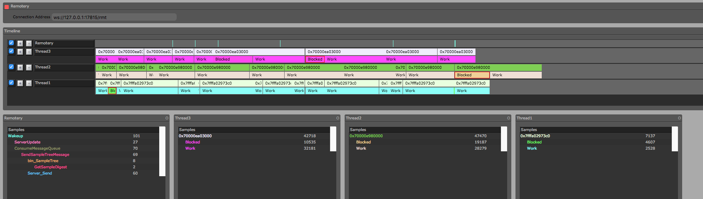
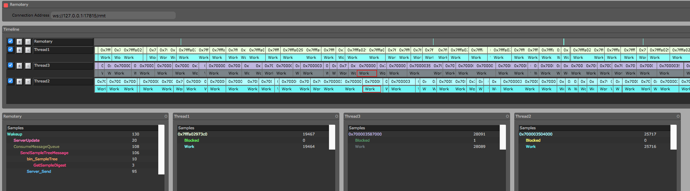

## EventHandlingPattern

### basic

This project contains the sample codes for EventHandlingPattern talk inside company.

* reactor_example
	* The reactor design pattern is an event handling pattern for handling service requests delivered concurrently to a service handler by one or more inputs. 
	* The service handler then demultiplexes the incoming requests and dispatches them synchronously to the associated request handlers.

* proactor_example
	* Proactor is a software design pattern for event handling in which long running activities are running in an asynchronous part. A completion handler is called after the asynchronous part has terminated.
	* The proactor pattern can be considered to be an asynchronous variant of the synchronous reactor pattern.

* boost.asio_example
	* show how strand enhance the performance with [Remotery](https://github.com/Celtoys/Remotery).
	* boost\_asio\_demo()
	* boost\_asio\_strand_demo
		* a demo of boost.asio with 3 threads.
		* Randomly create 1000 tasks compete for 7 handler, each handler is protected with a locked.
		* the **work** and **block** in the Remotery indicate the working and bloking time in each thraed.
	* normal result
	
	* strand result
	

### how to build
* cmake
* c++0x11
