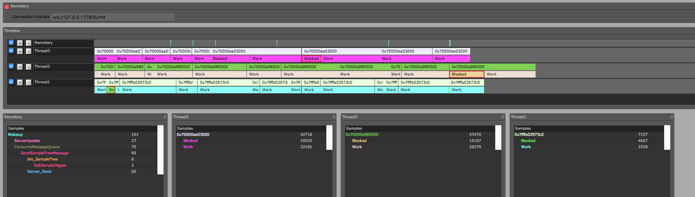
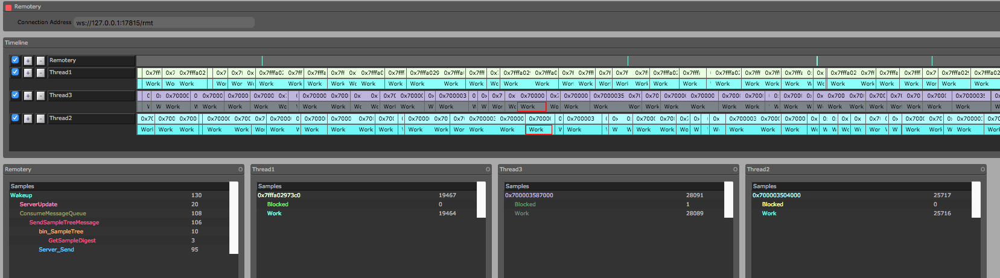

## Boost Asio exmaple with Remotery

### Preinstalled
* cmake
* boost
* c++0x11

### dependance
* [Remotery](https://github.com/Celtoys/Remotery)
	* a remotery is embeded in this demo 

### example
* boost\_asio\_demo()
* boost\_asio\_strand_demo
	* a demo of boost.asio with 3 threads.
	* Randomly create 1000 tasks compete for 7 handler, each handler is protected with a locked.
	* the **work** and **block** in the Remotery indicate the working and bloking time in each thraed.
* normal result
	
* strand result
	